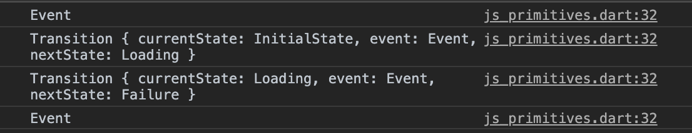
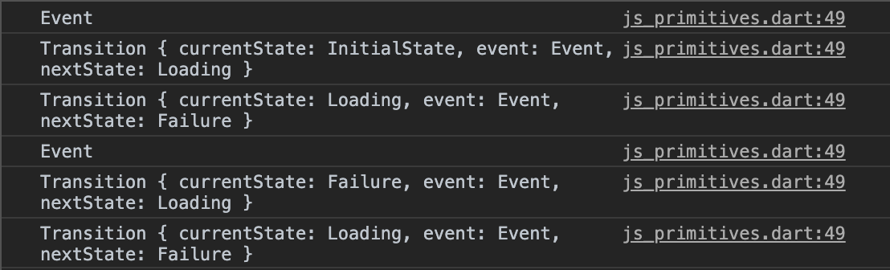

# dartdevc_exception_bug

## Reproduction Steps

1. Run in debug mode `flutter run -d chrome`
2. Open inspector and view logs

*Note: Only the first transition occurs...after the exception is caught no more state changes occur*

3. Run in delease mode `flutter run -d chrome --release`
2. Open inspector and view logs

*Note: Both transitions occur as expected*
